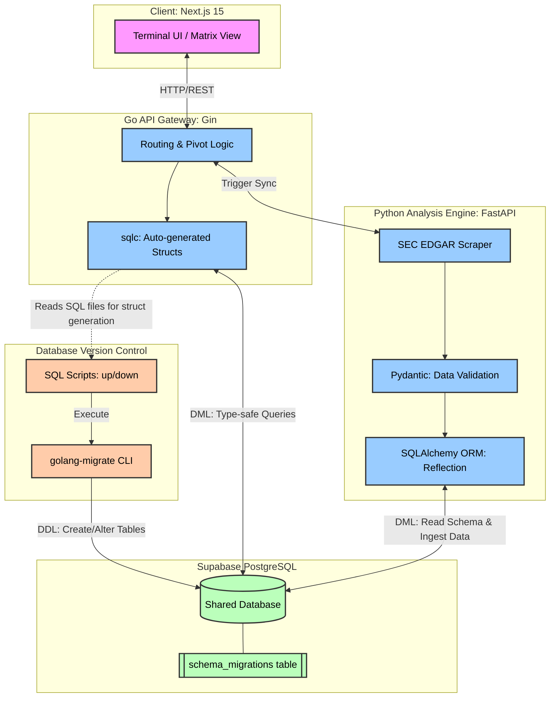

# 1. Project Vision

**QuantumValue Terminal** is a professional-grade financial archaeology platform. It provides a raw, high-fidelity view of a company's historical DNA by extracting and structuring data directly from regulatory filings (SEC EDGAR). The goal is to build a terminal for long-term fundamental analysis.

## System Architecture


## Happy Path (Sequence Diagram)
```
sequenceDiagram
    autonumber
    participant UI as Next.js UI
    participant Go as Go Gateway (sqlc)
    participant DB as Supabase PostgreSQL
    participant Py as Python Engine (SQLAlchemy)
    participant SEC as SEC EDGAR

    UI->>Go: GET /api/v1/financials/AAPL
    Go->>DB: Query financial_metrics (JSONB) & updated_at
    
    alt Scenario A: Cache Miss (Cold Start - No Data)
        DB-->>Go: Null (No records found)
        Go->>DB: Insert sync_status = 'IN_PROGRESS'
        Go-)+Py: [Async] POST /sync/AAPL<br/>(Trigger background scraping, non-blocking)
        Go-->>UI: 202 Accepted<br/>{status: "mining", msg: "Mining data..."}
        
        rect rgba(0, 150, 255, 0.1)
            Note over UI,Go: Frontend Polling Mechanism<br/>(e.g., every 3 seconds)
            loop Polling Loop
                UI->>Go: GET /api/v1/status/AAPL
                Go->>DB: Query sync_status
                DB-->>Go: 'IN_PROGRESS'
                Go-->>UI: 202 Accepted {status: "mining"}
            end
        end
        
        Note over Py,DB: Python Background Processing<br/>(User does not wait on original connection)
        Py->>SEC: Fetch Company Facts (20 years)
        SEC-->>Py: Raw JSON data
        Py->>Py: Validate & Build JSONB Dict<br/>via Pydantic
        Py->>DB: ORM Bulk Insert to filings &<br/>financial_metrics (JSONB)
        Py->>DB: Update sync_status = 'SUCCESS'
        Py--)-Go: 200 OK (Internal Callback)
        
        Note over UI,Go: Polling detects completion,<br/>fetches latest data
        UI->>Go: GET /api/v1/status/AAPL
        DB-->>Go: 'SUCCESS'
        Go-->>UI: 200 OK {status: "ready"}
        UI->>Go: GET /api/v1/financials/AAPL
        Go->>DB: Query financial_metrics (JSONB)
        DB-->>Go: JSONB Wide-Format Data
        Go-->>UI: 200 OK<br/>(Direct JSONB Pass-through)

    else Scenario B: Cache Hit (Warm Cache - Data Exists)
        DB-->>Go: JSONB Wide-Format Data + updated_at
        Go-->>UI: 200 OK (Ultra-fast response < 50ms)
        
        opt Stale-While-Revalidate (Data > 7 days old)
            Note over Go,Py: Silent Background Update<br/>(Completely transparent to user)
            Go->>DB: Update sync_status = 'IN_PROGRESS'
            Go-)+Py: [Async] POST /sync/AAPL
            Py->>SEC: Fetch latest 10-Q / 10-K
            SEC-->>Py: Diff Data
            Py->>DB: Insert new JSONB records
            Py->>DB: Update sync_status = 'SUCCESS'
            Py--)-Go: [Async Finish]
        end
    end
```